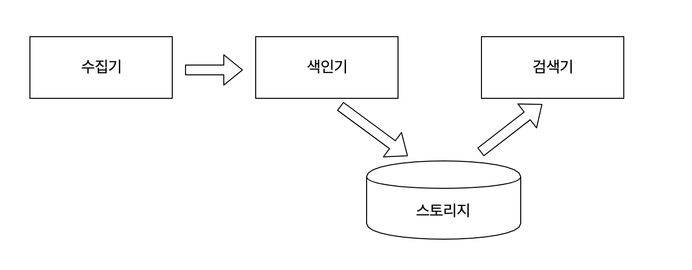

# 검색 시스템 이해하기

## 검색 시스템의 이해
### 검색시스템이란   
</br>  

**검색엔진**  
광활한 웹에서 정보를 수집해 검색 결과를 제공하는 프로그램  
</br>
**검색시스템**  
대용량 데이터를 기반으로 신뢰성 있는 검색 결과를 제공하기 위해 검색엔진을 기반으로 구축된 시스템을 통칭하는 용어
</br>      
**검색서비스**  
검색엔진을 기반으로 구축한 검색시스템을 활용해 검색 결과를 서비스로 제공한다.

```
검색 서비스 > 검색 시스템 > 검색 엔진
```

### 검색 시스템의 구성 요소  

**수집기**  
웹사이트, 블로그, 카페 등 웹에서 필요한 정보를 수집하는 프로그램. DB, 파일, 웹문서 등이 수집 대상이다.
</br>  
**스토리지**  
데이터베이스에서 데이터를 저장하는 물리적 장소로, 검색엔진은 색인 데이터를 스토리지에 저장한다.
</br>  
**색인기**  
수집된 정보를 사용자 질의와 일치시키는 작업을 하는 역할.
</br>  
**검색기**  
사용자 질의를 받아 색인기에서 저장한 역색인 구조에서 일치하는 문서를 찾아 결과로 반환한다.  


### 관계형 데이터베이스와의 차이점

데이터베이스의 모든 데이터는 중복을 제거하고 정형 데이터로 구조화해 행과 열로 구성된 테이블에 저장된다. SQL문을 이용해 원하는 정보의 검색이 가능한데 텍스트 매칭을 통한 단순한 검색만 가능하다. 텍스트를 여러 단어로 변형하거나 여러 개의 동의어나 유의어를 활용한 검색은 불가능하다.

반면 검색엔진은 데이터베이스에서는 불가능한 비정형 데이터를 색인하고 검색할 수 있다. 형태소 분석을 통해 사람이 구사하는 자연어의 처리가 가능해지고 역색인 구조를 바탕으로 빠른 검색 속도를 보장한다.

|엘라스틱서치|관계형 데이터베이스|
|---|---|
|인덱스|데이터베이스|
|샤드|파티션|
|타입|테이블|
|문서|행|
|필드|열|
|매핑|스키마|
|Query DSL|SQL|

ES 6.0이하 버전에서는 하나의 인덱스 내부에 기능에 따라 데이터를 분류하고 여러 타입을 만들어 사용했지만 현재는 하나의 인덱스에 하나의 타입만을 구성하도록 바뀌었다. 

|ES의 HTTP 메서드|기능|데이터베이스 질의 문법|
|---|---|---|
|GET|데이터 조회|SELECT|
|PUT|데이터 생성|INSERT|
|POST|인덱스 업데이트, 데이터 조회|UPDATE, SELECT|
|DELETE|데이터 삭제|DELETE|
|HEAD|인덱스의 정보 확인|-|

RESTful API는 HTTP 헤더와 URL만 사용해 다양한 형태의 요청을 할 수 있는 HTTP 프로토콜을 최대한 활용하도록 고안된 아키텍처이다. 다음은 엘라스틱서치를 사용하기 위한 간단한 API요청 구조다.
```
curl -X(메서드) http://host:port/(인덱스)/(타입)/(문서 id) -d '{json Data}'
```

ES에서의 검색은 SQL보다 유연한데, 가령 SQL에서 검색시 대소문자 구분등의 검색은 불가능하다. 그러나 ES의 경우에는 역색인되는 문자열 전체를 정책에 따라 소문자 혹은 대문자로 생성하고 쿼리가 들어오는 필터를 색인 시간과 검색 시간에 동일하게 지정한다면 해당하는 쿼리에 어떠한 문자열이 들어와도 검색이 가능해진다.

## 검색 시스템과 엘라스틱 서치
요즘에는 대량의 데이터를 빠르게 검색하기 위해 NoSQL을 많이 사용한다. 엘라스틱서치ㄴ도 NoSQL의 일종으로서 분류가 가능하고 분산 처리를 통해 실시간에 준하는 빠른 검색이 가능하다. 기존 DB로는 처리하기 어려운 대량의 비정형 데이터 검색도 가능하며, 전문 검색과 구조검색 모두 가능하다. 기본적으로는 검색엔진이지만 MongoDB나 HBase처럼 대용량 스토리ㅈ로 사용할 수 있다.

### 엘라스틱서치가 강력한 이유

**오픈소스 검색엔진**  
아파치 재단의 루씬기반 오픈소스 검색엔진으로 사용자가 많고 이로인해 프로젝트가 많이 활성화 됨.
</br>  
**전문 검색**
내용 전체를 색인해서 특정 단어가 포함된 문서를 검색할 수 있다. ES의 경우 다양한 기능별, 언어별 플러그인을 조합해 빠르게 검색할 수 있다.  
</br>
**통계분석**  
비정형 로그 데이터를 수집하고 한곳에 모아 통계 분석을 할 수 있다. 엘라스틱 서치와 키바나를 연결하면 실시간으로 쌓이는 로그를 시각화할 수 있다.  
</br>
**스키마리스**  
정형화 되지 않은 다양한 형태의 문서도 자동으로 색인, 검색할 수 있다.  
</br>
**멀티테넌시**  
검색할 필드명만 같으면 여러개의 인덱스를 한번에 조회할 수 있다.  
</br>
**Document-Oriented**  
여러 계층의 데이터를 JSON형식의 구조화된 문서로 인덱스에 저장할 수 있다. 
</br>  
**역색인**
종이책의 마지막 페이지에서 제공하는 색인 페이지와 비슷하게 제공되는 특수한 데이터 구조.  
</br>
*역색인된 단어와 문서 번호와의 관계*
|단어|문서번호|
|---|---|
|엘라스틱서치|1|
|검색엔진|1,2|
|역색인|2,3|
|데이터베이스|3|

'검색엔진' 이란 단어가 포함된 문서를 찾아야 한다고 하면 일반적으로 처음부터 끝까지 모든 문서를 읽어야만 원하는 결과를 찾을수 있지만, 역색인 구조에서는 해당 단어만 찾으면 단어가 포함된 모든 문서의 위치를 알 수 있기에 빠르게 찾을수 있다.  
</br>
**확장성과 가용성**h
엘라스틱서치를 분산 구성해서 확장한다면 대량의 문서를 좀 더 효율적으로 처맇라 수 있다. 분산 환경에서 데이터는 샤드라는 작은 단위로 나뉘어 제공되며, 인덱스를 만ㄷ르 때마다 샤드의 수를 조절할 수 있따. 이를 통해 데이터의 종류와 성격에 따라 데이터를 분산해서 빠르게 처리할 수 있다.


## 실습 환경 구축