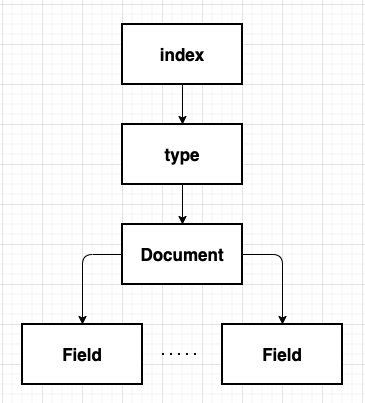

# 엘라스틱서치 살펴보기

엘라스틱서치는 루씬 기반의 검색엔진으로서 실시간에 가까운 전문 검색, 멀티 테넌시 지원이라는 특징을 자랑하며 NoSQL 저장소의 역할까지 담당한다. 단순한 검색엔진을 넘어 데이터 수집부터 저장, 분석, 시각화에 이르는 다양한 분야의 데이터 분석 도구로서 주목을 받고 있는 것이다.

- 엘라스틱서치를 구성하는 개념
- 엘라스틱서치에서 제공하는 주요 API

---
## 엘라스틱서치를 구성하는 개념



### 기본 용어
**인덱스**   
데이터 저장공간으로 하나의 인덱스는 하나의 타입만 가지며 하나의 물리적인 노드에 여러개의 논리적인 인덱스를 생성할 수 있다. 검색 시 인덱스 이름으로 문서 데이터를 검색하여, 여러 개의 인덱스를 동시에 검색하는 것도 가능하다. 

엘라스틱서치를 분산 환경으로 구성하면 하나의 인덱스가 여러 노드에 분산 저장되어 관리된다. 따라서 분산 처리에 따른 여러 이점을 누릴 수 있다. 엘라스틱서치는 인덱스 생성시 기본적으로 5개의 프라이머리 샤드와 1개의 레플리카 샤드 세트를 생성한다. (이는 옵션을 통해 조절 가능하다.)

**샤드**  
색인된 문서는 하나의 인덱스에 담긴다. 인덱스 내부에 색인된 데이터는 물리적인 공간에 여러 개의 파티션으로 나뉘어 구성되는데, 이 파티션을 엘라스틱서치에서는 샤드라고 한다. ES는 다수의 샤드로 문서를 분산저장하고 있어 데이터 손실 위험을 최소화할 수 있다.

**타입**  
타입은 인덱스의 논리적 구조를 의미하며 인덱스 속성에 따라 분류하기도 한다. ES6.0이하 버전에서는 하나의 인덱스에 여러 타입을 설정 가능했지만 6.1 버전부터는 인덱스당 하나의 타입만 사용할 수 있다.

엘라스틱서치 6.0 이하 버전에서는 특정 카테고리를 분류하는 목적으로 타입이 많이 사용됐다. 예를 들어 music이라는 인덱스가 존재한다면 장르별(Rock, K-Pop, Classic)로 분리해 사용했다. 하지만 현재는 타입을 사용하는 것을 권장하지 않기 때문에 장르별로 별도의 인덱스를 각각 생성해서 사용해야 한다.

**문서**  
문서는 엘라스틱서치에서 데이터가 저장되는 최소 단위다. 기본적으로 jSON 포맷으로 데이터가 저장된다. 데이터베이스와 비교하자면 테이블의 행이 엘라스틱서치의 문서에 해당한다고 볼 수 있다. 하나의 문서는 다수의 필드로 구성돼 있는데 각 필드는 데이터의 형태에 따라 용도에 맞는 데이터타입을 정의해야 한다. 또한 문서는 중첩 구조를 지원하기 때문에 이를 이용해 문서안에 문서를 지정하는 것도 가능하다.

**필드**  
필드는 문서를 구성하기 위한 속성이라고 할 수 있고, 일반적으로 데이터베이스의 칼럼과 비굑할 수 있으나 칼럼이 정적인 데이터타입인데 반해 필드는 좀 더 동적인 데이터타입이라고 할 수 있다.

하나의 필드는 목적에 따라 다수의 데이터 타입을 가질수 있다. 영화 정보를 담아둔 문서에 제목 필드가 있다고 가정하면, 영화 제목을 검색할 때 매칭 검색을 하거나 초성을 이용한 검색이 모두 지원되도록 제목 필드는 2개의 데이터 타입을 가져야 한다.

**매핑**  
매핑은 문서의 필드와 필드의 속성을 정의하고 그에 따른 색인 방법을 정의하는 프로세스다. 인덱스의 매핑 정보에는 여러 가지 데이터 타입을 지정할 수 있지만 필드명은 중복해서 사용할 수 없다.  

### 노드의 종류

클러스터는 물리적인 노드 인스턴스들의 모임이라 할 수 있다. 클러스터는 모든 노드의 검색과 색인 작업을 관장하는 논리적인 개념이라 할 수 있다. 관계형 데이터베이스의 경우 모든 요청을 서버 하나에서 처리해서 결과를 제공하지만 엘라스틱서치의 경우에는 다수의 서버로 분산해서 처리하는 것이 가능하기 때문에 대용량 데이터를 처리할 수 있다.

분산 처리를 위해서는 다양한 형태의 노드들을 조합해서 클러스터를 구성해야 한다. 기본적으로 마스터노드가 전체적인 클러스터를 관리하고 데이터 노드가 실제 데이터를 관리한다. 
```
마스터노드(Master Node)
- 클러스터를 관리한다.
- 노드 추가와 제거 같은 클러스터의 전반적인 관리를 담당한다. 

데이터노드(Data Node)
- 실질적인 데이터를 저장한다.
- 검색과 통계 같은 데이터 관련 작업을 수행한다.

코디네이팅 노드(Coordinating Node)
- 사용자의 요청만 받아서 처리한다.
- 클러스터 관련 요청은 마스터 노드에게 전달하고 데이터 관련 요청은 데이터 노드에게 전달한다.

인제스트 노드(Ingest Node)
- 문서의 전처리 작업을 담당한다.
- 인덱스 생성 전 문서의 형식을 다양하게 변경할 수 있다.
```

마스터노드 설정 elasticsearch.yml
```
node.master: true
node.data: false
node.ingest: false
search.remote.connect: false
```

데이터 노드 설정 elasticsearch.yml
```
node.master: false
node.data: true
node.ingest: false
search.remote.connect: false
```

코디네이팅 노드 설정 elasticsearch.yml
```
node.master: false
node.data: false
node.ingest: false
search.remote.connect: false
```

인제스트 노드
```
node.master: false
node.data: false
node.ingest: true
search.remote.connect: false
```

### 클러스터, 노드, 샤드

이 부분은 책을 참고하도록 하며, 일단 개인적으로 정리해보자면 위의 소제목 클러스터, 노드, 샤드는 물리적인 데이터 저장을 위한 개념이며 클러스터 > 노드 > 샤드 이다. 
즉, 클러스터 안에 여러 노드가 있으며, 여러 노드안에 여러 샤드가 있다.  
샤드의 설정된 수만큼 데이터가 잘게 쪼개져 각 샤드안에 저장된다. 샤드의 종류는 프라이머리 샤드와 레플리카 샤드가 있는데, 프라이머리 샤드의 경우 실제 사용될 데이터가 저장되는 공간이며, 레플리카 샤드는 복사본이 저장되는 공간이다. 

## 엘라스틱서치에서 제공하는 주요 API

### API의 종류  
엘라스틱서치는 RESTful 방식의 API를 제공하며, 이를 통해 JSON 기반으로 통신한다. 엘라스틱서치는 기본적으로 HTTP 통신을 위해 9200번 포트를 사용한다.
엘라스틱서치에서의 주요 API는 다음과 같다.
```
- 인덱스 관리 API(Indices API): 인덱스 관리
- 문서 관리 API(Document API): 문서의 추가/수정/삭제
- 검색 API(Search API): 문서 조회
- 집계 API(Aggregation API): 문서 통계
```

문서를 색인하기 위해서는 기본적으로 인덱스라는 그릇을 생성해야 한다. 인덱스를 통해 입력되는 문서의 필드를 정의하고 각 필드에 알맞은 데이터 타입을 지정할 수 있다.  
```
Index vs Indices
색인은 데이터가 토큰화되어 저장된 자료구조를 의미하며, Index라는 단어를 번역한 것이다. 하지만 엘라스틱서치에서는 인덱스라는 용어를 색인과는 다른 의미로 사용한다.
- Index: 색인 데이터
- Indexing: 색인하는 과정
- Indices: 매핑 정보를 저장하는 논리적인 데이터 공간
```

### 스키마리스 기능은 가급적이면 사용하지 말자.  
엘라스틱서치는 스키마리스라는 강력한 기능을 제공하며, 이를 이용하면 다양한 형태의 비정형 데이터를 하나의 인덱스로 구성할 수 있지만, 이능 성능과 밀접한 연관이 있기 때문에 특수한 상황에서만 사용해야 한다. 만약 스키마리스를 사용해야 한다면 데이터 구조 및 검색 방식을 확실히 이해해야 한다.

엘라스틱서치는 스키마리스라는 특성에 따라 데이터에 대한 매핑을 자동으로 생성하는 편리한 기능을 제공한다. 하지만 이 기능은 특수한 상황에서만 제한적으로 사용해야 한다. 사실상 실무에서는 대부분 사용하지 않는다. 실무에서는 데이터가 대부분 복잡한 구조를 갖기 때문에 자칫 검색 품질이 떨어지거나 성능상 문제가 발생할 가능성이 커지기 때문이다. 

스키마리스를 이용해 색인한다면 기본적으로 text 타입의 Standard Analyzer를 사용하는 데이터 타입이 정의될 것이다. 이러한 경우에는 원치 않는 방식으로 토큰이 분리될 수 있다.

### 인덱스 관리 API 

인덱스 관리 API는 인덱스를 관리하기 위한 API다. 이를 이용해 인덱스를 추가하거나 삭제할 수 있다. 인덱스 관리 API는 HTTP 메서드를 지정하는 방식을 통해 사용할 수 있다.

**인덱스 생성**  
인덱슬르 생성할 때는 매핑이라는 세부 설정을 이용할 수 있는데 매핑은 문서와 문서에 포함된 필드, 필드 타입등을 세세하게 지정하는 것이 가능한 설정 방식이다. 인덱스 생성시 이러한 매핑 정보를 추가할 수 있다. 

한가지 주의할 점은 한번 생성된 매핑 정보는 변경할 수 없다는 점이다. 만약 잘못 생성했거나 변경해야 하는 경우에는 데이터를 삭제하고 다시 색인하는 수밖에 없다.

```
PUT /movie
{
    "settings": {
        "number_of_shards": 3,
        "number_of_replicas": 2
    },
    "mappings": {
        "_doc": {
            "properties": {
                "movieCd": {"type": "integer"},
                "movieNm": {"type": "text"},
                "movieNmEn": {"type": "text"},
                "prdtYear": {"type": "integer"},
                "openDt": {"type": "date"},
                "typeNm": {"type": "keyword"},
                "prdtStatNm": {"type": "keyword"},
                "nationAlt": {"type": "keyword"},
                "genreAlt": {"type": "keyword"},
                "repNationNm": {"type": "keyword"},
                "repGenreNm": {"type": "keyword"},
            }
        }
    }
}
```
단순히 문자열을 원할때는 keyword를 사용하면 되고 형태소 분석을 원할 경우에는 text를 사용하면 된다. 

**인덱스 삭제**  
이번에는 인덱스를 삭제하고 다시 생성한다. 앞서 생성한 movie 인덱스를 DELETE 메서드로 삭제한다.
다음 명령을 수행한다.
```
DELETE /movie
```

### 문서 관리 API
문서 관리 API는 실제 문서를 색인하고 조회, 수정, 삭제를 지원하는 API다. 이를 이용해 문서를 색인하고 내용을 수정하거나 삭제할 수 있다. 엘라스틱서치는 기본적으로 검색엔진이기 때문에 검색을 위해 다양한 검색 패턴을 지원하는 Search API를 별도로 제공한다. 하지만 색인된 문서의 ID를 기준으로 한 건의 문서를 다뤄야 하는 경우에는 문서 관리 API를 사용한다. 

- Index API : 한 건의 문서를 색인한다.
- Get API : 한 건의 문서를 조회한다.
- Delete API :  한 건의 문서를 삭제한다.
- Update API : 한 건의 문서를 업데이트한다.

문서 관리 API는 기본적으로 한 건의 문서를 처리하기 위한 기능을 제공하며 Single Document API라고도 부른다. 하지만 클러스터를 운영하다 보면 다수으 ㅣ문서를 처리해야 하는 경우도 발생하는데 이럴때 쓰는 것이 Multi-document API다. 

- Multi Get API: 다수의 문서를 조회한다.
- Bulk API: 대량의 문서를 색인한다.
- Delete By Query API: 다수의 문서를 삭제한다.
- Update By Query API: 다수의 문서를 업데이트 한다.
- Reindex API: 인덱스의 문서를 다시 색인한다. 

### 검색 API 

엘라스틱서치 검색 API의 사용 방식은 다음과 같이 크게 두가지로 나뉜다.
1. HTTP URI 형태의 파라미터를 URI에 추가해 검색하는 방법
2. RESTful API 방식인 QueryDSL을 사용해 요청 본문에 질의 내용을 추가해 검색하는 방법

```
1. HTTP URI 형태의 파라미터를 URI에 추가해 검색하는 방법
GET /movie/_doc/DFJDGSjgLSKDGSDGLGSDGGsdg

2. RESTful API 방식인 QueryDSL을 사용해 요청 본문에 질의 내용을 추가해 검색하는 방법
GET /movie/_doc/_search?q=prdtYear:2017&pretty=true
{
    "sort" : {
        "movieCd" : {
            "order" : "asc"
        }
    }
}
```


쿼리 구문은 다음과 같이 여러개의 키를 조합해 객체의 키 값으로 사용할 수 있다.
```
{
    size: # 몇 개의 결과를 반환할지 결정(기본값은 10)

    from: # 어느 위치부터 반환할지를 결정
          # 0부터 시작하면 상위 0~10건의 데이터를 반환한다(기본값은 0).
    
    _source: # 특정 필드만 결과로 반호나하고 싶을 때 사용한다.

    sort: # 특정 필드를 기준으로 정렬한다.
          # asc, desc로 오름차순, 내림차순 정렬을 지정할 수도 있다.
    
    query: {
        # 검색될 조건을 정의한다.
    }

    filter: {
        # 검색 결과 중 특정한 값을 다시 보여준다.
        # 결과 내에서 재검색할 때 사용하는 기능 중 하나다.
        # 다만 필터를 사용하게 되면 자동으로 score값이 정렬되지 않는다.
    }
}
```

### 집계 API

과거에는 통계 작업을 위해 루씬이 제공하는 패싯(Facet)기능을 많이 활용했지만, 패싯 기능은 기본적으로 디스크 기반으로 동작했고, 분산환경에는 최적화되지 않았기 때문에 대용량 데이터의 통계 작업에는 적합하지 않았다. 

그래서 ES 5.0이후에 패싯 방식의 통계 기능을 제거하고 독자적인 집계(Aggregation)API를 내놓았다. 집계 API는 기본적으로 메모리 기반으로 동작하기 때문에 대용량의 데이터 통계 작업이 가능해졌다. 

집계 기능은 현재 4가지 API로 제공된다. 집계 기능은 서로 조합해 사용할 수 있으며 이를 조합해서 매우 강력한 기능을 제공할 수 있다.

```
버킷 집계
집계중 가장 많이 사용된다. 문서의 필드를 기준으로 버킷을 집계한다.

메트릭 집계
문서에서 추출된 값을 가지고 Sum, Max, Min, Avg를 계산한다.

매트릭스 집계
행렬의 값을 합하거나 곱한다.

파이프라인 집계 
버킷에서 도출된 결과 문서를 다른 필드 값으로 재분류한다. 즉, 다른 집계에 의해 생성된 출력 결과를 다시 한번 집계한다. 집계가 패싯보다 강력한 이유가 여기에 있다.